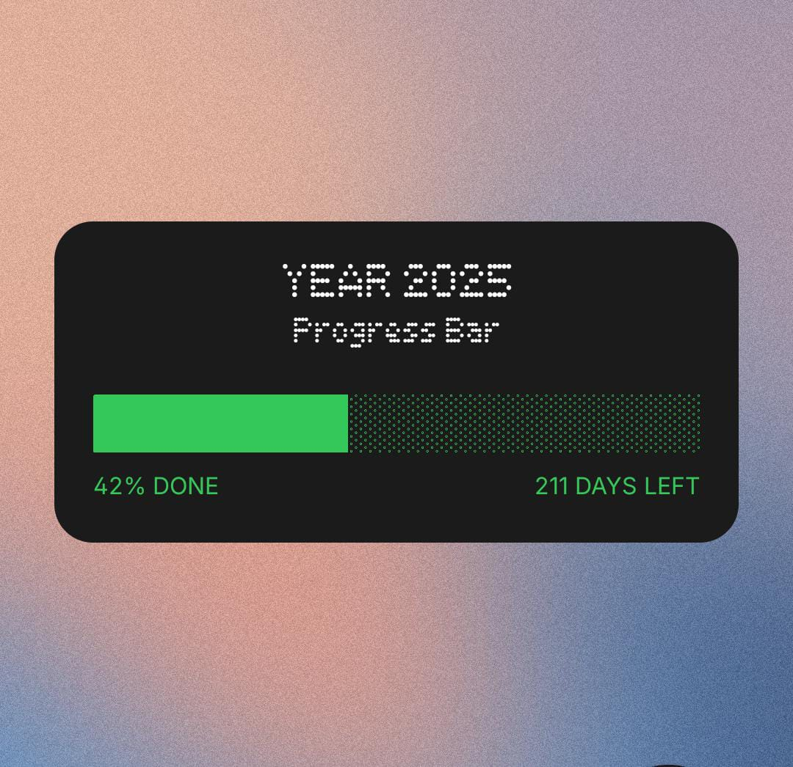

# ⬛ Nothing-Inspired Year Progress Widget — 2025

A **Nothing OS**-inspired progress widget to track how much of the year 2025 has passed — visually and meaningfully.

Minimal. Motivational.

---

## ✨ Features

- 🧮 Real-time percentage of the year completed
- 📆 Countdown of days left in 2025
- 🔲 Inspired by **Nothing’s design language**
- 💻 Ideal for lock screens and home screens
- 🧠 Helps you visualize time passing and stay goal-focused

---

## 🎨 Design Language

This widget follows the **Nothing Design Language**:

- ⬛ Minimal black card background  
- ⚪ Dot-matrix pixel font  
- 🟩 High-contrast green progress bar  
- 🧊 Rounded edges, grid-aligned layout

---
